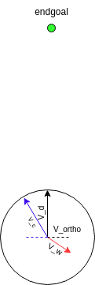

# wind_compensation

Wind compensation calculations. Considering a given constant velocity and max speed to reach. The following diagram further detail the calculations: 

V_d - velocity vector of the desired speed. 

V_w - velocity vector of the wind speed. 

V_ortho - velocity vector of the orthogonal part of the wind speed to the desired speed. 

V_c - velocity vector of the desired speed with wind compensation.

